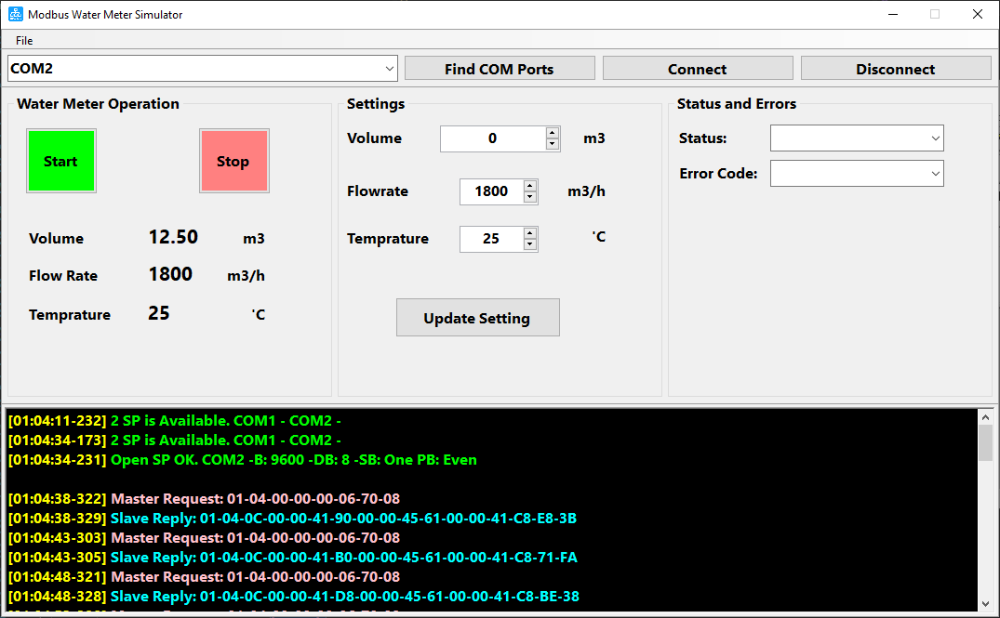
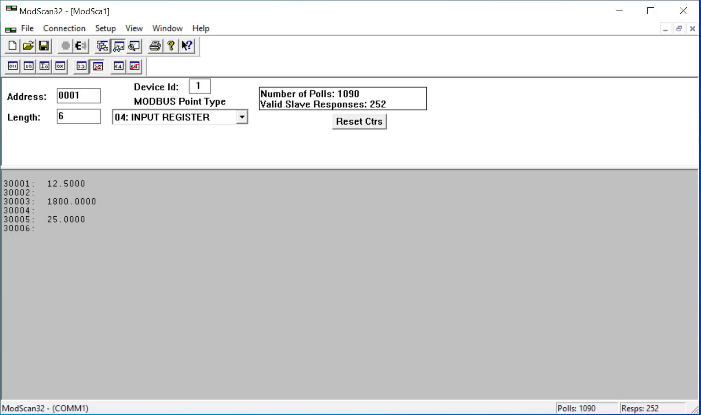

# Modbus Water Meter Simulator
Modbus Water Meter Device Simulator 

  
  <!-- -->

# Project goals
  - Simple Modbus software device for testing Modbus slave protocol
  - Study communication protocol between Modbus master and Modbus slave

# Water Meter Features
  - Simple software water meter 
  - Support Voluem, Flowrate, Temprature 
  - Support Modbus master requests 

 
